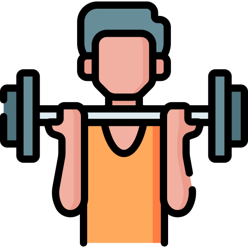
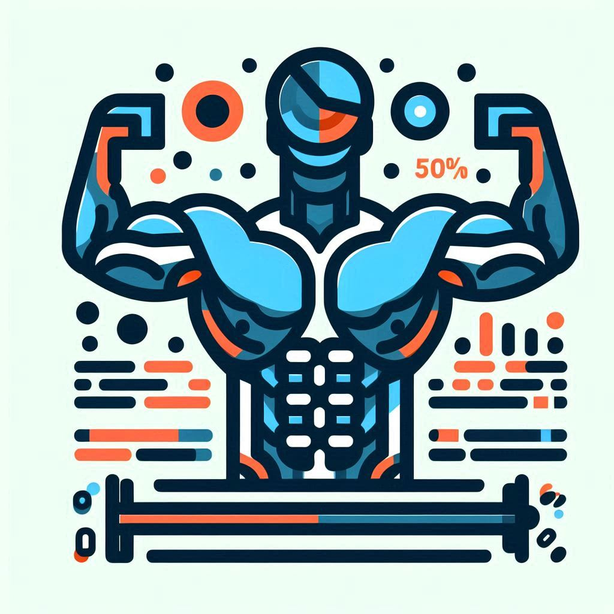

    

  <h3 align="center">🏋️‍♂️ Projeto de Assistente de Personal Trainer Personalizado</h3>

O objetivo desse projeto é criar um assistente de personal trainer que seja capaz de gerar treinos personalizados para cada usuário com base em suas características individuais.

## Coleta de Informações Iniciais:

O usuário fornece informações como:

- Biotipo Corporal: Isso pode incluir categorias como ectomorfo, mesomorfo ou endomorfo.
Disponibilidade de Tempo: Quanto tempo o usuário pode dedicar aos treinos (por dia ou por semana).
Preferências de Exercícios: Quais tipos de exercícios o usuário gosta ou prefere (por exemplo, musculação, corrida, ioga, etc.).

- Análise e Personalização:
Com base nas informações coletadas, o assistente analisa e cria um perfil do usuário.
Ele considera fatores como objetivos (perda de peso, ganho de massa muscular, condicionamento físico), nível de condicionamento atual e eventuais restrições (lesões, problemas de saúde).
O assistente também leva em conta a combinação de biotipo corporal, disponibilidade de tempo e preferências de exercícios.

- Montagem do Treino:
O assistente gera um plano de treino personalizado.
Isso pode incluir:
Exercícios: Uma lista de exercícios específicos (com descrições e vídeos) para cada grupo muscular ou área do corpo.

- Sequência: A ordem em que os exercícios devem ser realizados.
Volume e Intensidade: Número de séries e repetições, bem como a carga (peso) a ser usada.
Cardio: Recomendações para atividades aeróbicas, como corrida, ciclismo ou natação.

- Acompanhamento e Adaptação:
O assistente pode fornecer lembretes para os treinos agendados.
À medida que o usuário progride ou enfrenta desafios, o assistente pode ajustar o treino com base no feedback e nos resultados obtidos.

## 📋 Índice

- [📋 Índice](#-índice)
- [📝 Introdução](#-introdução)
- [💪 Biotipos Corporais](#-biotipos-corporais)
- [📅 Dias Disponíveis para Treino](#-dias-disponíveis-para-treino)
- [🏋️ Tipos de Exercícios](#️-tipos-de-exercícios)
- [🛠️ Regras de negócio](#️-regras-de-negócio)
- [📖 Material de Apoio](#-material-de-apoio)
- [🎯 Prompt de Resposta Proposto](#-prompt-de-resposta-proposto)

---

## 📝 Introdução

O projeto consiste em criar um assistente de personal trainer que monta treinos sob medida para cada pessoa da modalidade esportiva desejada. O usuário informa seu biotipo corporal, quantos dias pode treinar e suas preferências de exercícios, e o assistente faz o resto. É como ter um personal trainer virtual! 

---

## 💪 Biotipos Corporais

A primeira regra para personalizar o treino é determinar o biotipo corporal do usuário. Existem três biotipos principais:

<table>
  <tr>
    <th>Imagem</th>
    <th>Biotipo</th>
    <th>Descrição</th>
  </tr>
  <tr>
    <td style="text-align: center;">
      
    </td>
    <td><strong>Ectomorfo</strong></td>
    <td>Tendem a ser magros, mesmo com dietas hipercalóricas. Possuem ombros estreitos e membros (pernas e braços) compridos.</td>
    <td>Corpo mais magro, difícil ganhar peso e massa muscular.</td>
  </tr>
  <tr>
    <td style="text-align: center;">
      
    </td>
    <td><strong>Mesomorfo</strong></td>
    <td>Apresentam troncos mais largos, cintura e quadril mais estreitos.</td>
    <td>Corpo naturalmente musculoso, facilidade para ganhar massa muscular e perder gordura.</td>
  </tr>
  <tr>
    <td style="text-align: center;">
      
    </td>
    <td><strong>Endomorfo</strong></td>
    <td>Metabolismo é ais lento, o que dificulta a definição muscular.</td>
    <td>Corpo com tendência a acumular gordura, maior dificuldade em perder peso.</td>
  </tr>
</table>

> **Nota:** Escolha o biotipo que mais se aproxima do seu corpo atual para que o treino seja mais eficiente.

---

## 📅 Dias Disponíveis para Treino

A segunda regra é determinar quantos dias por semana o usuário tem disponível para treinar. Dependendo do número de dias, o treino sugerido pode variar:

| **Imagem**                                                     | **Dias por Semana** | **Tipo de Treino Sugerido** |
| -------------------------------------------------------------- | ------------------- | --------------------------- |
|  | 1 dia               | Treino Full Body            |

|  | 2 dia               | Treino AB            |

|  | 3 dias              | Treino ABC                  |

|  | 5 dias              | Treino ABCDE                |

- **Full Body**: Treino que trabalha o corpo todo em uma única sessão.
- **AB**: Treino é muito comum para iniciantes ou então, para pessoas em início do processo de periodização.Usado bastante o treino A/B em uma fase pré-básica da periodização, geralmente após um período sem treinos resistidos.
- **ABC**: Divisão do treino em três dias, cada um focado em grupos musculares diferentes.
- **ABCDE**: Divisão do treino em cinco dias, com foco ainda mais específico em cada grupo muscular.

---

## 🏋️ Tipos de Exercícios

A terceira regra envolve a escolha do tipo de exercício preferido. Aqui estão algumas categorias com exemplos:

| **Imagem**                                                       | **Tipo de Treino** | **Descrição**                                                                                                 |
| ---------------------------------------------------------------- | ------------------ | ------------------------------------------------------------------------------------------------------------- |
|  | **Funcional**      | Exercícios que melhoram a funcionalidade do corpo, usando movimentos naturais.                                |
|   | **Maquinas**     | Exercícios feitos em máquinas, com foco em isolar grupos musculares.                                          |
|      | **Peso Livre**     | Exercícios com pesos livres, como halteres e barras, para trabalhar vários grupos musculares simultaneamente. |
|    | **Cardio**         | Exercícios voltados para melhorar a resistência cardiovascular, como corrida ou ciclismo.                     |
|    | **Hipertrofia**         | Exercícios que tem o objetivo que servem para aumentar o volume muscular do corpo.                     |
|      | **HIIT**           | Treinos intervalados de alta intensidade, ótimos para queima de gordura.                                      |
|  | **Terapêutico**      | Exercícios que servem para combater o estresse diário, com foco na redução de danos agressivos à saúde mental                                |
---

## 🛠️ Regras de negócio

1. **Identifique seu biotipo corporal** consultando a seção de biotipos.
2. **Determine quantos dias por semana você pode treinar** e escolha o tipo de treino mais adequado.
3. **Selecione o tipo de exercício** que prefere realizar e que se encaixa melhor nos seus objetivos.
4. Use o prompt do assistente para gerar um plano de treino personalizado.

---

## 🎯 Prompt de Resposta Proposto
